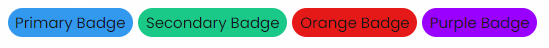
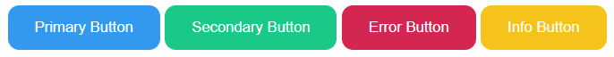
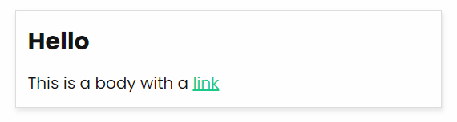
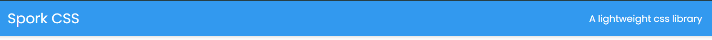
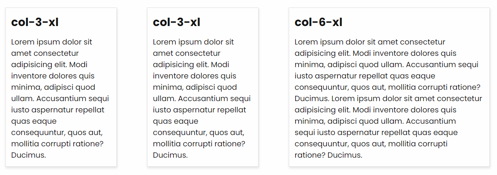

# Components
The following components are part of the library as of now, with more in progress.

## Badge
Badges are capsule sized informational sections also called pills in some design systems.

**Usage**
```html
<div class="badge-primary">Primary Badge</div>
<div class="badge-secondary">Secondary Badge</div>
<div class="badge-orange">Orange Badge</div>
<div class="badge-purple">Purple Badge</div>
```


## Button
Buttons are standard html button styles which come in different colors. 
**Usage**

```html
<button class="btn-primary">Primary Button</button>
<button class='btn-secondary'>Secondary Button</button>
<button class='btn-error'>Error Button</button>
<button class='btn-info'>Info Button</button>
```


## Card
This is a standard card with a slight dropshadow to hold related information together.

**Usage**

```html
<div class="card">
  <div class="card-title">Hello</div>
  <div class="card-body">
    <p>This is a body with a <a href="#">link</a></p>
  </div>
</div>
```


## Navbar
This is a simple implementation of a navigation system.

**Usage**
```html
<nav class="navbar-primary text-white mb-4">
  <div class="container">
    <h2 class="site-title">Spork CSS</h2>
    <p>A lightweight css library</p>
  </div>
</nav>
```


## Grid System
A responsive 12 column grid system where we can specify how each column should behave based on the screen sizes.

**Usage**
```html
<div class="row gap-2 justify-center">
  <div class="col-12-xs col-5-sm col-3-xl">
    <div class="card">
      <h3 class="card-title">col-3-xl</h3>
      <p class="card-body">
        Lorem ipsum dolor sit amet consectetur adipisicing elit. Modi inventore dolores quis minima, adipisci quod ullam. Accusantium sequi iusto aspernatur repellat quas eaque consequuntur, quos aut, mollitia corrupti ratione? Ducimus.
      </p>
    </div>
  </div>
  <div class="col-12-xs col-5-sm col-3-xl">
    <div class="card">
      <h3 class="card-title">col-3-xl</h3>
      <p class="card-body">
        Lorem ipsum dolor sit amet consectetur adipisicing elit. Modi inventore dolores quis minima, adipisci quod ullam. Accusantium sequi iusto aspernatur repellat quas eaque consequuntur, quos aut, mollitia corrupti ratione? Ducimus.
      </p>
    </div>
  </div>
  <div class="col-12-xs col-5-sm col-6-xl">
    <div class="card">
      <h3 class="card-title">col-6-xl</h3>
      <p class="card-body">
        Lorem ipsum dolor sit amet consectetur adipisicing elit. Modi inventore dolores quis minima, adipisci quod ullam. Accusantium sequi iusto aspernatur repellat quas eaque consequuntur, quos aut, mollitia corrupti ratione? Ducimus.
        Lorem ipsum dolor sit amet consectetur adipisicing elit. Modi inventore dolores quis minima, adipisci quod ullam. Accusantium sequi iusto aspernatur repellat quas eaque consequuntur, quos aut, mollitia corrupti ratione? Ducimus.
      </p>
    </div>
  </div>
  </div>
</div>
```

